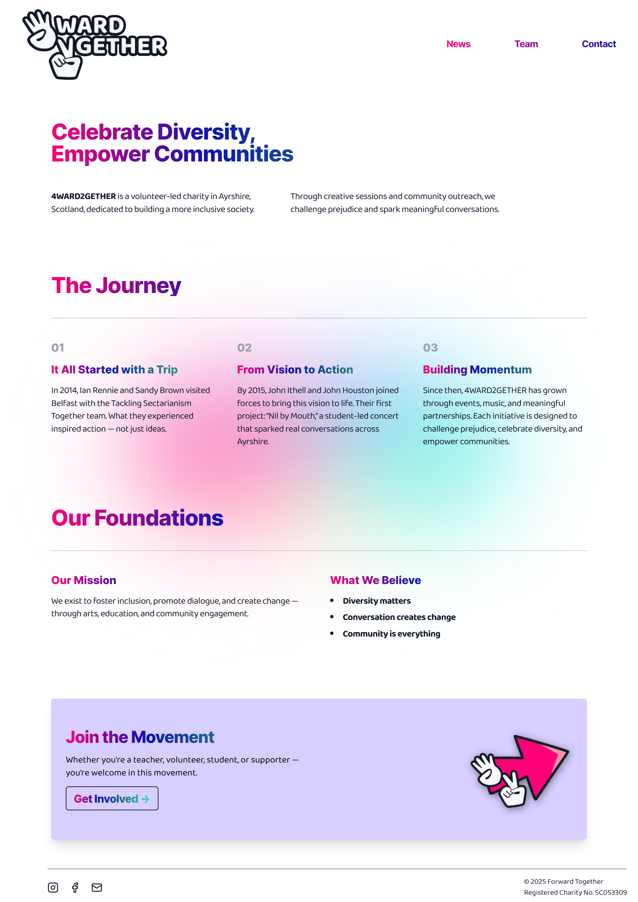

# 4WARD2GETHER

**Celebrate Diversity, Empower Communities**

4WARD2GETHER is a website for a Scottish charity that supports youth and community development. With a bold, colourful, and modern design inspired by Swiss graphic principles, the site reflects the organisation’s mission to amplify voices, share stories, and connect communities. Built with Next.js and styled with Tailwind CSS.

## 🧱 Built With

  
  

[Next.js](https://nextjs.org/) – React Framework for fast static and server-rendered sites.
[Tailwind CSS](https://tailwindcss.com/) – Utility-first styling for responsive design.

  

## 🚀 Features

* **Playful Editorial Layout:** Swiss-inspired layout with bold typography and geometric structure
* **Inclusive & Vibrant Visuals:** Uses animated gradients, illustration, and a bright, welcoming tone
* **Mobile Responsive:** Fully responsive and accessible across all screen sizes
* **API Integration Ready:** Supports Instagram news feed via Elfsight

## 🔗 Link to Deployed Site

👉 [https://www.4ward2gether.com/](https://www.4ward2gether.com/)